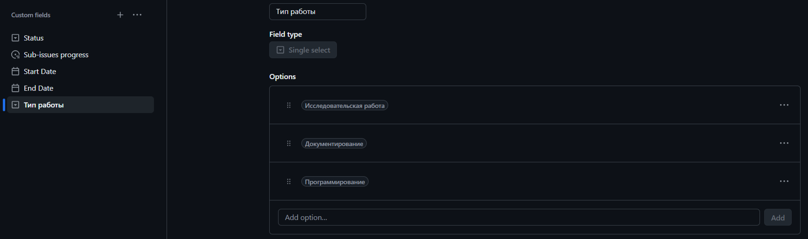
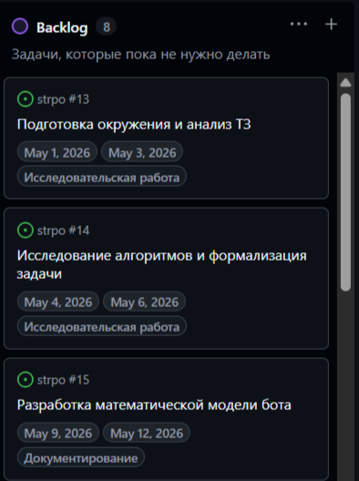
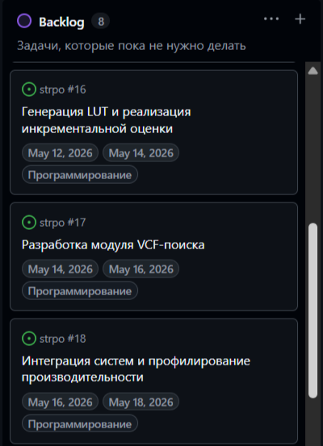
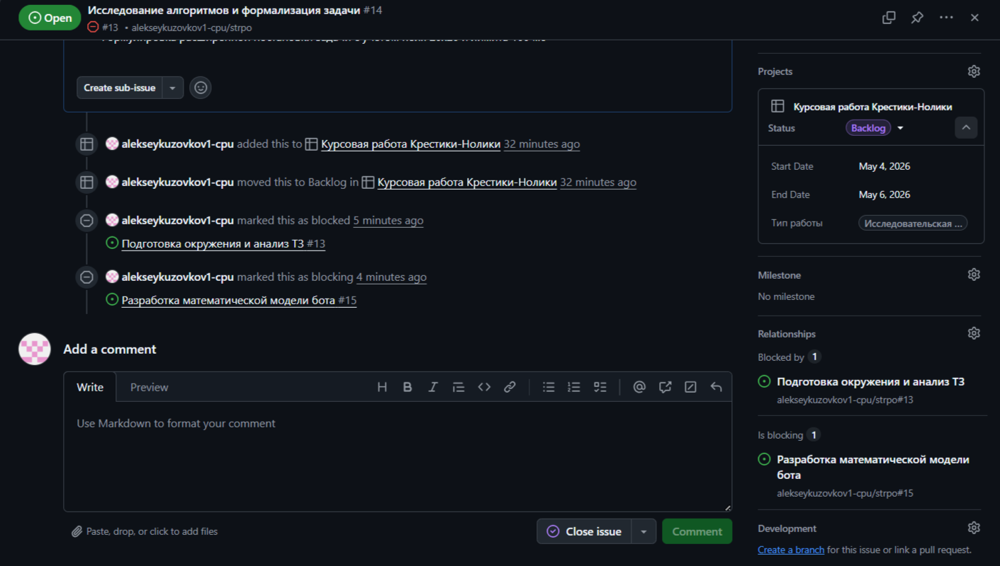
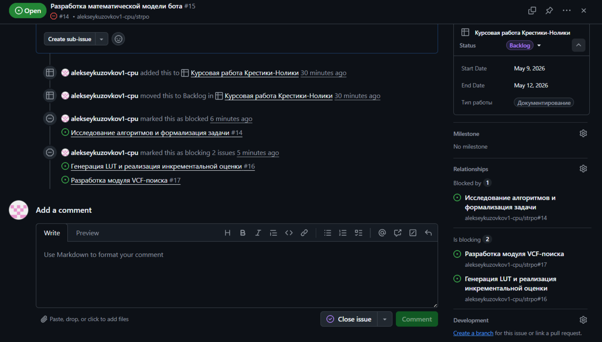
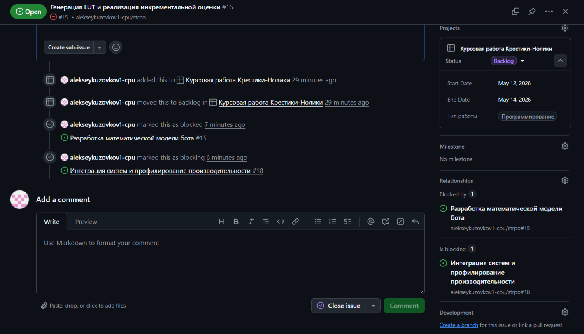
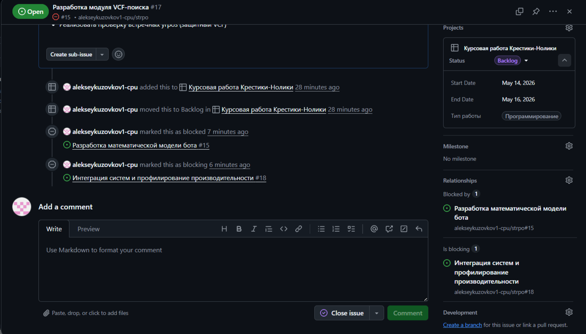
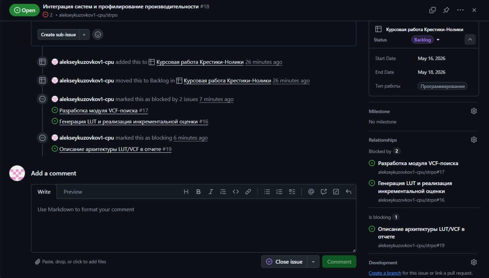
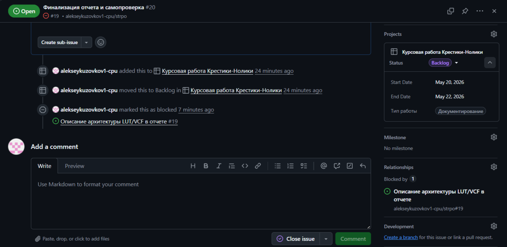

 Лабораторная №5

## Ход работы

### 1. Создание и настройка проекта
* В репозитории **strpo** был создан проект "**Курсовая работа Крестики-Нолики**":

* После создания были настроены необходимые этапы по проекту:
    1. **Backlog** - задачи, которые пока не нужно делать
    2. **Ready** - задачи, над которыми еще не работают, но которые должны быть выполнены в ближайшее время
    3. **In Progress** - задачи, находящиеся в работе
    4. **Review** - работы на согласовании
    5. **Done** - задача выполнена

    

* В поля задач были добавлены "**Start Date**" и "**End Date**":
    

* В поля задач был добавлен пункт "**Тип работы**" с выбором вариантом: **Исследовательская работа**, **Документирование**, **Программирование**

### 2. Планирование работ по курсовой работе
* Курсовая работа была декомпозирована на следующие задачи:
    1. Подготовка окружения и анализ ТЗ

        **Что требуется**: сборка проекта из предоставленного репозитория. Изучение интерфейсов ttt::game::IPlayer и ttt::game::State. Ручное тестирование игры (Human vs Baseline) для понимания механики препятствий и логики

        **Артефакты**: заметка с описанием ключевых методов API (как получить состояние клетки, как вернуть ход) и успешно собранный бинарный файл test_my_player_vs_human

    2. Исследование алгоритмов и формализация задачи

        **Что требуется**: изучение теории игр (минимакс, альфа-бета отсечение, LUT-таблица). Составление расширенной постановки задачи с учетом ограничений по времени (100 мс) и полю (20х20)

        **Артефакты**: черновик разделов "Введение" и "Постановка задачи" для будущего отчета

    3. Разработка математической модели бота

        **Что требуется**: описание алгоритма человеческим языком. Определение формулы оценки позиции (например, вес за 3 или 4 знака в ряд с учетом открытых концов). Проектирование логики обработки препятствий #

        **Артефакты**: файл "алгоритм" с описание алгоритма, текст для раздела "Математическое описание"

    4. Генерация LUT и реализация инкрементальной оценки
    
        **Что требуется**: написание скрипта для генерации Look-Up Table и рассчет веса для каждого состояния, реализация механизма инкрементального обновления: при ходе в точку (x, y) пересчитываются только индексы LUT в 4 направлениях
        
        **Артефакты**: заголовочный файл с предрассчитанной таблицей весов и функция update_incremental_score

    5. Разработка модуля VCF-поиска (Victory of Continuous Fours)

        **Что требуется**: реализация алгоритма поиска по форсированным ходам (построение цепочек четверок). Написание специализированного поиска в глубину (DFS), который анализирует только угрозы и ответы на них. Модуль должен уметь находить победную серию ходов и определять моменты, когда нужно переходить к защите от встречного VCF-наступления

        **Артефакты**: Класс VCFSolver, тесты на нахождение форсированных матов в 3, 5 и 7 ходов

    6. Интеграция систем и профилирование производительности

        **Что требуется**: сборка всех модулей в единый цикл принятия решения: сначала проверка своего VCF (победа), затем проверка VCF противника (защита), и только потом - выбор хода по данным инкрементальной LUT-оценки. Проведение тестов против "Hard" бота. Замер времени работы VCF-модуля: если поиск затягивается, внедрение механизма отсечения (таймаута), чтобы уложиться в 100 мс

        **Артефакты**: финальный код игрока, таблица замеров времени хода и статистики побед над игроком повышенной сложности

    7. Описание архитектуры LUT/VCF в отчете

        **Что требуется**: подготовка раздела "Особенности реализации". Описание того, как LUT заменяет тяжелые вычисления на быстрое обращение к памяти. Визуализация работы VCF-поиска: построение дерева угроз и объяснение, как алгоритм отсекает неперспективные ветки. Описание структур данных, использованных для инкрементальных обновлений

        **Артефакты**: текстовый черновик раздела отчета "Особенности реализации"

    8. Финализация отчета и самопроверка

        **Что требуется**: написание заключения, проверка отчета на наличие недочетов

        **Артефакты**: готовый отчет

* Были созданы тикеты в терминах проекта Github для декомпозированных выше задач, заданы нужные типы и проставлены примерные сроки:

* Были заданы связи между задачами, которые зависят друг от друга:

### 3. Выполнение задачи
