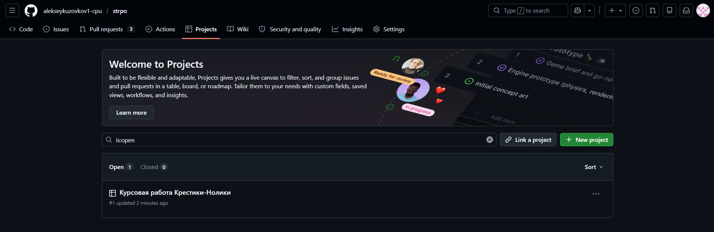
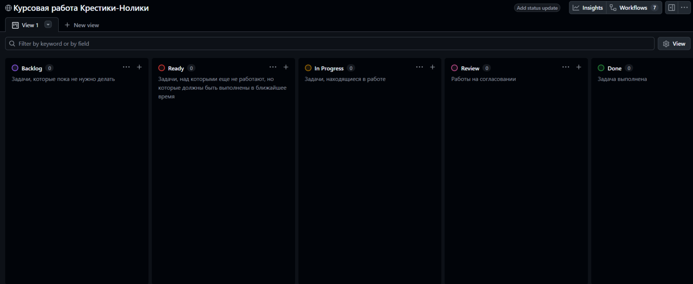
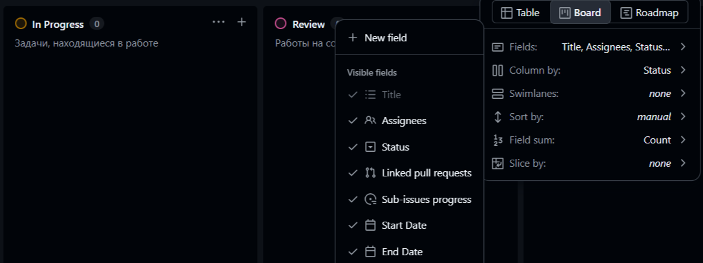
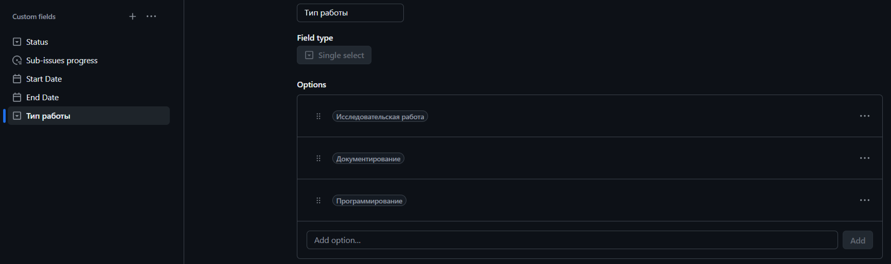
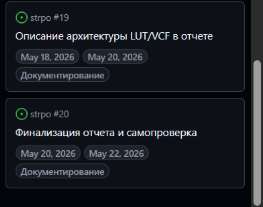
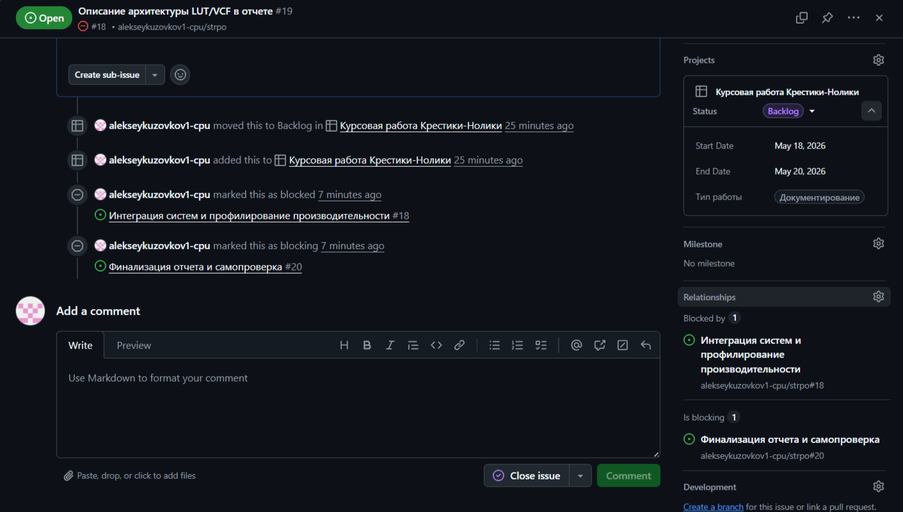
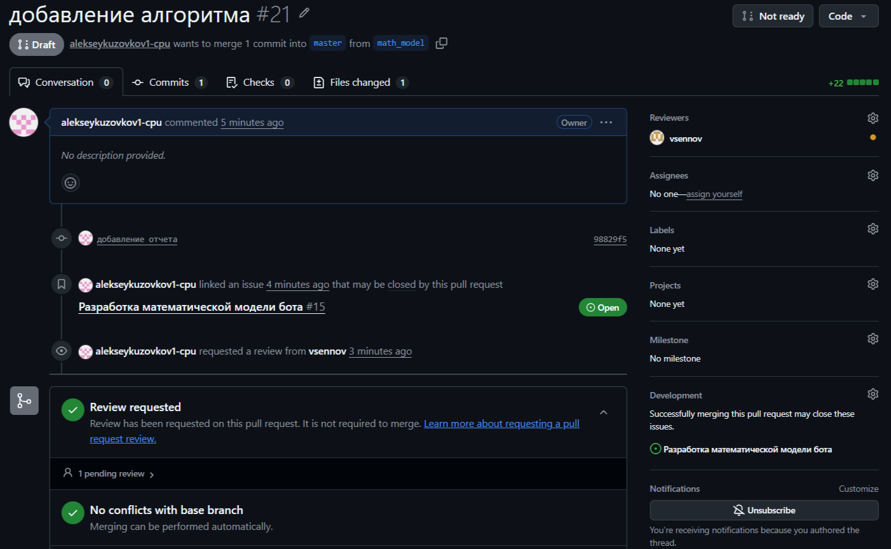
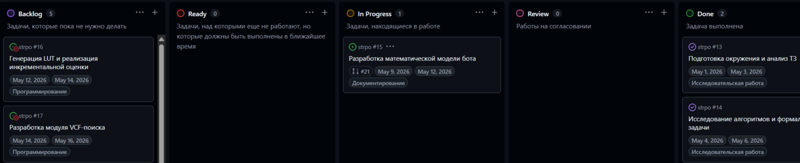

 Лабораторная №5

## Ход работы

### 1. Создание и настройка проекта
* В репозитории **strpo** был создан проект "**Курсовая работа Крестики-Нолики**":

* После создания были настроены необходимые этапы по проекту:
    1. **Backlog** - задачи, которые пока не нужно делать
    2. **Ready** - задачи, над которыми еще не работают, но которые должны быть выполнены в ближайшее время
    3. **In Progress** - задачи, находящиеся в работе
    4. **Review** - работы на согласовании
    5. **Done** - задача выполнена

    

* В поля задач были добавлены "**Start Date**" и "**End Date**":
    

* В поля задач был добавлен пункт "**Тип работы**" с выбором вариантом: **Исследовательская работа**, **Документирование**, **Программирование**

### 2. Планирование работ по курсовой работе
* Курсовая работа была декомпозирована на следующие задачи:
    1. Подготовка окружения и анализ ТЗ

        **Что требуется**: сборка проекта из предоставленного репозитория. Изучение интерфейсов ttt::game::IPlayer и ttt::game::State. Ручное тестирование игры (Human vs Baseline) для понимания механики препятствий и логики

        **Артефакты**: заметка с описанием ключевых методов API (как получить состояние клетки, как вернуть ход) и успешно собранный бинарный файл test_my_player_vs_human

    2. Исследование алгоритмов и формализация задачи

        **Что требуется**: изучение теории игр (минимакс, альфа-бета отсечение, LUT-таблица). Составление расширенной постановки задачи с учетом ограничений по времени (100 мс) и полю (20х20)

        **Артефакты**: черновик разделов "Введение" и "Постановка задачи" для будущего отчета

    3. Разработка математической модели бота

        **Что требуется**: описание алгоритма человеческим языком. Определение формулы оценки позиции (например, вес за 3 или 4 знака в ряд с учетом открытых концов). Проектирование логики обработки препятствий #

        **Артефакты**: файл "алгоритм" с описание алгоритма, текст для раздела "Математическое описание"

    4. Генерация LUT и реализация инкрементальной оценки
    
        **Что требуется**: написание скрипта для генерации Look-Up Table и рассчет веса для каждого состояния, реализация механизма инкрементального обновления: при ходе в точку (x, y) пересчитываются только индексы LUT в 4 направлениях
        
        **Артефакты**: заголовочный файл с предрассчитанной таблицей весов и функция update_incremental_score

    5. Разработка модуля VCF-поиска (Victory of Continuous Fours)

        **Что требуется**: реализация алгоритма поиска по форсированным ходам (построение цепочек четверок). Написание специализированного поиска в глубину (DFS), который анализирует только угрозы и ответы на них. Модуль должен уметь находить победную серию ходов и определять моменты, когда нужно переходить к защите от встречного VCF-наступления

        **Артефакты**: Класс VCFSolver, тесты на нахождение форсированных матов в 3, 5 и 7 ходов

    6. Интеграция систем и профилирование производительности

        **Что требуется**: сборка всех модулей в единый цикл принятия решения: сначала проверка своего VCF (победа), затем проверка VCF противника (защита), и только потом - выбор хода по данным инкрементальной LUT-оценки. Проведение тестов против "Hard" бота. Замер времени работы VCF-модуля: если поиск затягивается, внедрение механизма отсечения (таймаута), чтобы уложиться в 100 мс

        **Артефакты**: финальный код игрока, таблица замеров времени хода и статистики побед над игроком повышенной сложности

    7. Описание архитектуры LUT/VCF в отчете

        **Что требуется**: подготовка раздела "Особенности реализации". Описание того, как LUT заменяет тяжелые вычисления на быстрое обращение к памяти. Визуализация работы VCF-поиска: построение дерева угроз и объяснение, как алгоритм отсекает неперспективные ветки. Описание структур данных, использованных для инкрементальных обновлений

        **Артефакты**: текстовый черновик раздела отчета "Особенности реализации"

    8. Финализация отчета и самопроверка

        **Что требуется**: написание заключения, проверка отчета на наличие недочетов

        **Артефакты**: готовый отчет

* Были созданы тикеты в терминах проекта Github для декомпозированных выше задач, заданы нужные типы и проставлены примерные сроки:

* Были заданы связи между задачами, которые зависят друг от друга:

### 3. Выполнение задачи

* Для задачи "**Разработка математической модели бота**" был создан черновой запрос на слияние, в качестве ревьювера указан преподаватель:

* В данный момент тикет находится в "**In Progress**":

* По готовности тикет будет отправлен в "**Review**", после чего черновой запрос будет переведен в готовый. По итогам ревью тикет будет перемещен в нужную стадию на доске ("**In Progress**"/"**Done**"), пока запрос на слияние не будет принят

### 4. Исследование альтернатив

* Для реализации похожего процесса можно использовать следующие решения для управления проектами:
1. Jira (Atlassian)

    * **Основные возможности**: самый мощный инструмент в индустрии. Поддерживает продвинутые Agile-доски, кастомные рабочие процессы любой сложности и глубокую аналитику (диаграммы сгорания задач, контрольные графики)

    * **Ограничения Free-тарифа**: бесплатно до 10 пользователей. Ограничено дисковое пространство (2 ГБ) и функционал автоматизации (количество запусков скриптов в месяц)

    * **Применимость**: идеально подходит для крупных команд, где нужно строго разграничивать роли и этапы тестирования

2. Trello (Atlassian)

    * **Основные возможности**: визуально ориентированная система на базе карточек и досок. Главный плюс - простота и гибкость. Через "Power-Ups" интегрируется с GitHub, Google Drive и Slack

    * **Ограничения Free-тарифа**: ограничение на количество "командных" досок (до 10). Размер вложений ограничен 10 МБ

    * **Применимость**: лучший выбор для небольших творческих проектов или личного планирования, где важна наглядность, а не строгий контроль версий

3. GitLab Issues

    * **Основные возможности**: встроенный инструмент внутри платформы GitLab. Полностью повторяет логику GitHub, но имеет более мощные встроенные инструменты CI/CD и Wiki прямо из коробки

    * **Ограничения Free-тарифа**: ограничение на время работы серверов для автоматической сборки кода (Pipeline minutes) и общий объем хранилища репозитория

    * **Применимость**: прямая альтернатива GitHub. Выбирается, если компания или университет используют self-hosted серверы GitLab для приватности кода

4. YouTrack (JetBrains)

    * **Основные возможности**: инструмент от создателей CLion и IntelliJ IDEA. Обладает уникальной системой поиска по задачам (через консольные команды) и встроенным трекером времени, что важно для оценки трудозатрат

    * **Ограничения Free-тарифа**: бесплатно для команд до 10 человек. Облачная версия имеет лимит по месту на диске

    * **Применимость**: популярен среди программистов благодаря тесной интеграции с IDE и мощным инструментам для работы с багами

* Для реализации процесса, описанного в лабораторной работе, была выбрана система Trello. Адаптировать текущий рабочий процесс под этот инструмент можно следующим образом:

    * **Организация Workflow**: создается доска с пятью стандартными списками: Backlog, Ready, In Progress, Review, Done. Перемещение карточек между списками осуществляется их перекидыванием

    * **Управление полями**: вместо текстовых полей используются Labels (Цветные метки) для обозначения типа работы (синий - исследование, зеленый - разработка). Даты начала и окончания настраиваются через стандартный модуль Dates

    * **Связи между задачами**: зависимости реализуются через прикрепление ссылок на "блокирующие" карточки в описании текущей задачи. В платных версиях это автоматизировано, в бесплатных контролируется вручную.

    * **Интеграция с GitHub**: с помощью Power-Up "GitHub" к карточкам Trello привязываются конкретные ветки и Pull Request-ы. Это позволяет видеть статус кода (например, "Draft PR"), не покидая интерфейс Trello

    * **Автоматизация**: робот Butler настраивается на автоматическое перемещение карточки в колонку Done, когда на GitHub закрывается связанный с ней Pull Request

Источники:

* [Jira Cloud Pricing & Features](https://www.atlassian.com/software/jira/pricing)

* [Trello Free Plan Details](https://trello.com/pricing)

* [Trello Butler Automation Guide](https://help.trello.com/article/1172-getting-started-with-butler)

* [GitLab SaaS Feature Comparison](https://about.gitlab.com/pricing/)

* [GitLab Issues Documentation](https://docs.gitlab.com/ee/user/project/issues/)

* [YouTrack Pricing and Comparison](https://www.jetbrains.com/youtrack/buy/)

* [YouTrack Features: Timg1/ime Tracking & Search Query Language](https://www.jetbrains.com/youtrack/buy/)
