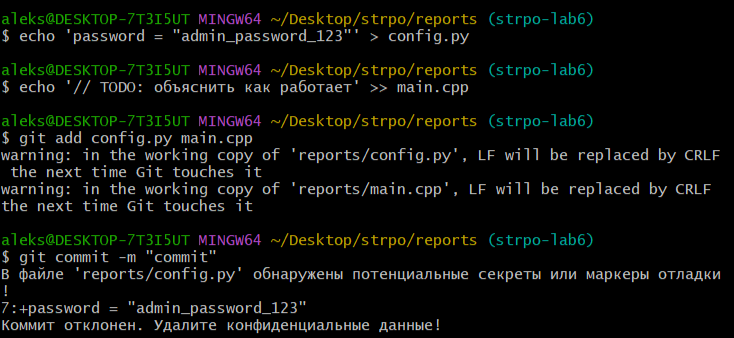
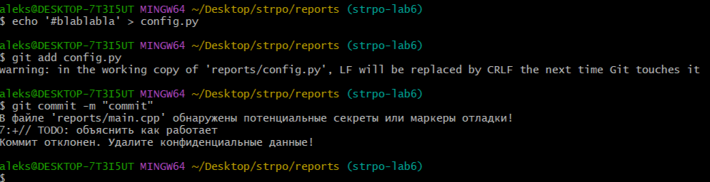
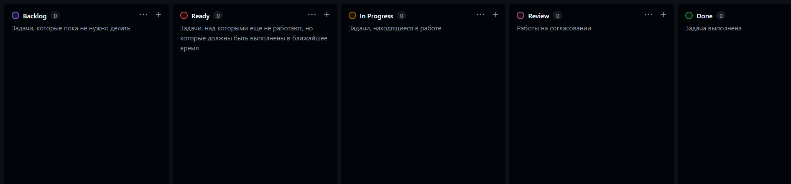

# Лабораторная №6

## Ход работы

### 1. Базовые хуки в Git на стороне клиента

* **Git-хуки** -- это скрипты, которые автоматически запускаются системой контроля версий при наступлении определенных событий. Клиентские хуки выполняются на локальном компьютере разработчика и не переносятся в репозиторий при push (их нужно настраивать отдельно или использовать инструменты вроде Husky)

* Операции и этапы, к которым можно добавить код:

    * Рабочий процесс коммита (Committing-Workflow):
        * **pre-commit**: запускается перед тем, как будет введено сообщение коммита. Используется для проверки кода (линтинг, тесты, форматирование)

        * **prepare-commit-msg**: запускается перед созданием сообщения коммита, но после определения стандартного шаблона. Позволяет динамически изменять сообщение (например, вставлять номер задачи из ветки)

        * **commit-msg**: запускается после ввода сообщения пользователем. Позволяет проверять соответствие сообщения стандартам (например, Conventional Commits)

        * **post-commit**: запускается сразу после завершения процесса коммита. Обычно используется для уведомлений

    * Рабочий процесс электронной почты (Email Workflow):

        * **applypatch-msg**, **pre-applypatch**, **post-applypatch**: используются при работе с патчами (`git am`)

    * Другие клиентские операции:
        * **pre-rebase**: запускается перед началом операции `rebase`

        * **post-checkout**: срабатывает после успешного выполнения `git checkout` или `git switch`. Удобно для очистки временных файлов или настройки окружения

        * **post-merge**: запускается после успешного слияния веток (`merge`)

        * **pre-push**: запускается непосредственно перед отправкой данных на удаленный сервер (`git push`)

* Клиентские Git-хуки с возможностью прерывания операций:

    * `pre-commit`

        **Прерывает**: `git commit`

        **Применение**: проверка кода линтерами, запуск модульных тестов или поиск забытых отладочных данных (например, console.log или print). Если скрипт находит ошибки, коммит не будет создан

    * `prepare-commit-msg`

        **Прерывает**: `git commit`

        **Применение**: обычно используется для вставки шаблонов, но может остановить процесс, если не удается динамически сформировать сообщение (например, если скрипт не смог извлечь ID задачи из названия ветки)

    * `commit-msg`

        **Прерывает**: `git commit`

        **Применение**: валидация текста сообщения. Если комментарий не соответствует правилам (например, слишком короткий или не следует стандарту Conventional Commits), операция создания коммита прерывается

    * `pre-rebase`

        **Прерывает**: `git rebase`

        **Применение**: защита от изменения истории. Скрипт может запретить `rebase`, если пользователь пытается применить его к защищенным веткам (например, main) или к коммитам, которые уже были отправлены в общий репозиторий

    * `pre-push`

        **Прерывает**: `git push`

        **Применение**: финальный барьер перед отправкой кода на сервер. Здесь часто запускают тяжелые интеграционные тесты или проверяют код на наличие случайно оставленных секретов (паролей, ключей доступа)

    * `pre-applypatch`

        **Прерывает**: `git am`

        **Применение**: срабатывает после применения патча, но до того, как изменения будут зафиксированы. Позволяет проверить состояние рабочего дерева и отменить наложение патча, если оно нарушает целостность проекта

    * `pre-merge-commit`

        **Прерывает**: `git merge`

        **Применение**: вызывается при слиянии веток (если оно проходит без конфликтов) непосредственно перед созданием коммита слияния. Позволяет провести дополнительные проверки итогового состояния кода

[Источник](https://git-scm.com/book/ru/v2/Настройка-Git-Хуки-в-Git)

* Добавлен хук, который проверяет код, добавляемый в коммит, на предмет наличия запрещенных слов или паттернов

    * В файл "**pre-commit.sample**" (расширение нужно убрать для работы хука) из папки **.git/hooks** был добавлен следующий блок:

        ```
        PATTERNS="BEGIN (RSA|OPENSSH|DSA) PRIVATE KEY|password\s*=|token\s*=|TODO"

        # получаем список файлов в индексе
        STAGED_FILES=$(git diff --cached --name-only --diff-filter=d | grep -v '\.md$')

        for FILE in $STAGED_FILES; do
            # проверяем только добавленные строки в файле на наличие паттернов
            if git diff --cached "$FILE" | grep -qE "$PATTERNS"; then
                echo "В файле '$FILE' обнаружены потенциальные секреты или маркеры отладки!"
                git diff --cached "$FILE" | grep -nE "$PATTERNS"
                echo "Коммит отклонен. Удалите конфиденциальные данные!"
                exit 1
            fi
        done
        ```

    * Данный код защищает от случайного добавления SSH-ключей, SSL-сертификатов, паролей, токенов и TODO

    * Демонстрация работы хука:
        
        


* Добавлен хук, который проверяет сообщение коммита и останавливает процесс фиксации, если что-то не так с сообщением коммита

    * В файл "**commit-msg.sample**" (расширение нужно убрать для работы хука) из папки **.git/hooks** был добавлен следующий блок:
        ```
        COMMIT_MSG_FILE="$1"
        COMMIT_MSG=$(cat "$COMMIT_MSG_FILE")

        if [ ${#COMMIT_MSG} -lt 10 ]; then
            echo >&2 "Сообщение слишком короткое (минимум 10 символов)"
            exit 1
        fi
        ```

    * Данный код защищает от слишком короткого сообщения коммита

    * Демонстрация работа хука:
        


### 2. Хуки Git на стороне сервера
* Создание репозитория
    * Была создана копия моего репозитория на моем компьютере (уровнем выше рабочего репозитория strpo, на Рабочем столе):
        ```
        mkdir -p /C/Users/aleks/Desktop/strpo/server_repo.git
        cd /C/Users/aleks/Desktop/strpo/server_repo.git
        git init --bare
        ```
        * Использование ключа --bare критически важно для сервера, так как Git запрещает делать push в обычный репозиторий, если в нем открыта та же ветка

    * Копия была добавлена в качестве удаленного репозитория в мой основной репозиторий:
        ```
        cd ~/Desktop/strpo/reports
        git remote add local-server /C/Users/aleks/Desktop/strpo/server_repo.git
        ```

    * `push` в копию командой `git push local-server strpo-lab6` происходит успешно:
        ```
        aleks@DESKTOP-7T3I5UT MINGW64 ~/Desktop/strpo/reports (strpo-lab6)
        $ git push local-server strpo-lab6
        Enumerating objects: 119, done.
        Counting objects: 100% (119/119), done.
        Delta compression using up to 12 threads
        Compressing objects: 100% (102/102), done.
        Writing objects: 100% (119/119), 49.71 KiB | 1018.00 KiB/s, done.
        Total 119 (delta 25), reused 0 (delta 0), pack-reused 0 (from 0)
        remote: Resolving deltas: 100% (25/25), done.
        To C:/Users/aleks/Desktop/strpo/server_repo.git
        * [new branch]      strpo-lab6 -> strpo-lab6

        ```

* Был изучен вопрос конвертации Markdown в HTML

    * Для конвертации Markdown в HTML существует несколько подходящих способов:

        * Pandoc

            * **Pandoc** - мощный инструмент для конвертации документов. Он поддерживает практически все форматы

                **Команда**:
                ```
                pandoc lab6.md -o lab6.html
                ```
                **Стилизация**: флаг -s создает полноценный файл с тегами head и body:
                ```
                pandoc lab6.md -s -o lab6.html
                ```

        * VS Code

            1. Установить расширение "Markdown All in One" или "Markdown PDF"
            2. Открыть нужный .md файл
            3. Нажать `Ctrl + Shift + P` и ввести `Markdown: Export to HTML`

        Источники:
        1. [Официальное руководство VS Code по Markdown](https://code.visualstudio.com/docs/languages/markdown)
        2. [Pandoc](https://pandoc.org/)

* В моей копии был настроен хук, который будет создавать html-версию отчета из md-файла по последней версии из указанной ветки, а также проведет тестовый пуш

    * В папке **server_repo.git/hooks/** был создан серверный хук "**post-receive.sample**" (расширение нужно убрать для работы хука) со следующим содержанием:
        ```
        #!/bin/bash

        # настройки путей
        TARGET="/C/Users/aleks/Desktop/www"
        GIT_DIR="/C/Users/aleks/Desktop/strpo/server_repo.git"
        BRANCH="strpo-lab6"

        # создаем целевую папку, если ее нет
        mkdir -p $TARGET

        # выгружаем последнюю версию файлов из ветки strpo-lab6 в папку www
        git --work-tree=$TARGET --git-dir=$GIT_DIR checkout -f $BRANCH

        # конвертация Markdown в HTML
        FILE_MD="$TARGET/reports/lab6.md"
        FILE_HTML="$TARGET/reports/lab6.html"

        if [ -f "$FILE_MD" ]; then
            if command -v pandoc &> /dev/null; then
                pandoc "$FILE_MD" -s -o "$FILE_HTML"
                echo "Отчет успешно сконвертирован в HTML: $FILE_HTML"
            else
                echo "Pandoc не найден. Файлы обновлены, но HTML не создан"
            fi
        else
            echo "Файл $FILE_MD не найден для конвертации"
        fi
        ```
    * Выдача прав на выполнение:
        ```
        chmod +x /C/Users/aleks/Desktop/server_repo.git/hooks/post-receive
        ```
    * Тестовый `push` прошел успешно: